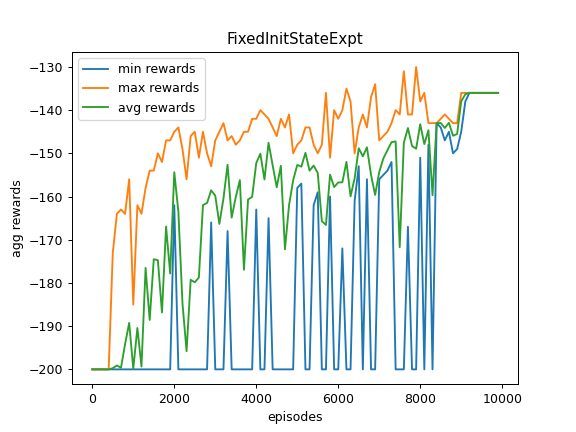
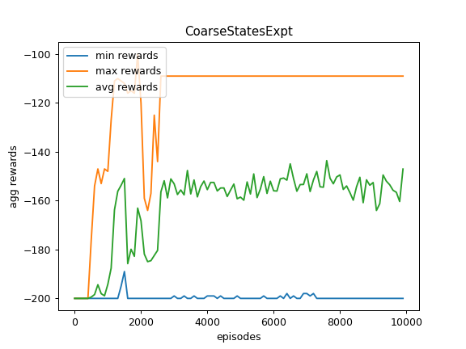
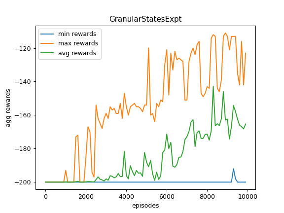
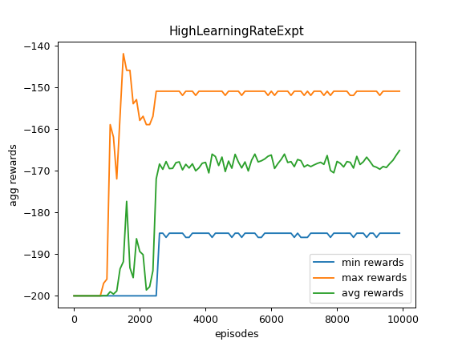
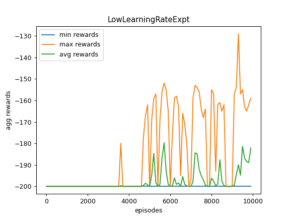
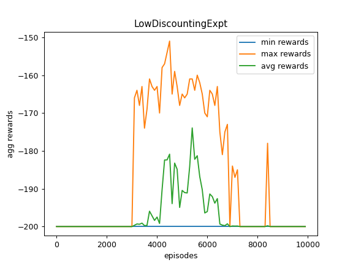
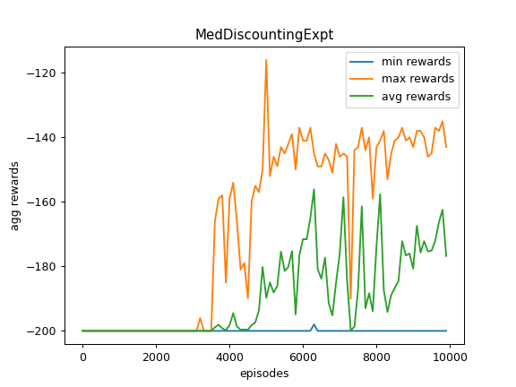
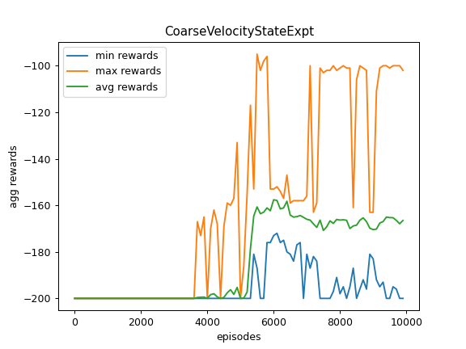
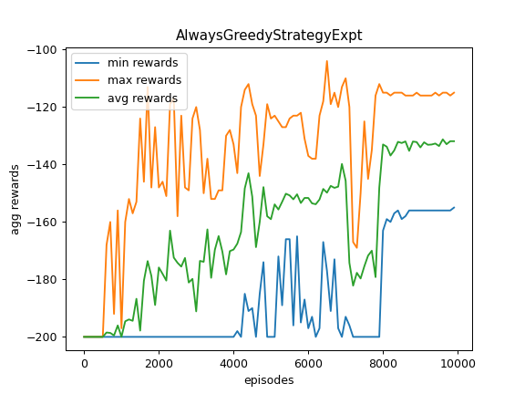

FixedInitStateExpt  

CoarseStatesExpt  

GranularStatesExpt  

HighLearningRateExpt  

LowLearningRateExpt  

LowDiscountingExpt  

MedDiscountingExpt  

CoarseVelocityStateExpt  

AlwaysGreedyStrategyExpt  

